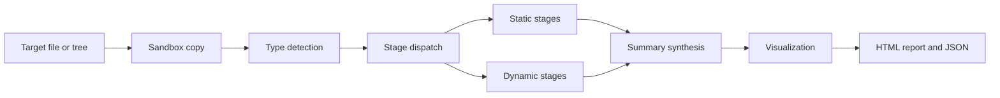

<div align="center">

# RE-Toolkit

**Reverse-engineering workstation provisioner and binary-analysis pipeline for Debian and Kali Linux.**

<!-- Dynamic shields: these render live repository state. -->
[](https://github.com/Sandler73/RE-Toolkit/actions/workflows/ci.yml)
[](https://github.com/Sandler73/RE-Toolkit/actions/workflows/codeql.yml)
[](https://github.com/Sandler73/RE-Toolkit/releases)
[](https://github.com/Sandler73/RE-Toolkit/commits/main)
[](https://github.com/Sandler73/RE-Toolkit/issues)
[](LICENSE)

<!-- Project characteristic shields. -->
[](CHANGELOG.md)
[](https://github.com/Sandler73/RE-Toolkit/wiki/Stage-Reference)
[](#supported-target-types)
[](tests/)
[](https://www.gnu.org/software/bash/)
[](https://www.python.org/downloads/)
[](#requirements)
[](tools/check-no-emdash.py)

[Quick start](#quick-start) - [Installation](#installation) - [Usage](https://github.com/Sandler73/RE-Toolkit/wiki/Usage) - [Architecture](https://github.com/Sandler73/RE-Toolkit/wiki/Architecture-and-Design) - [Stage reference](https://github.com/Sandler73/RE-Toolkit/wiki/Stage-Reference) - [Wiki](https://github.com/Sandler73/RE-Toolkit/wiki)

</div>

---

## Overview

RE-Toolkit has two halves that work together. `install-retoolkit.sh` provisions a
complete static and dynamic analysis environment: disassemblers, decompilers,
format parsers, deobfuscators, signature scanners, and the Python stack they
depend on. `analyze-binaries.sh` then drives those tools, running a target
through a type-appropriate sequence of analysis stages and producing structured
JSON plus a self-contained HTML report.

The design goal is depth without babysitting. Point the analyzer at a file or a
directory tree and it detects each target's type, selects the applicable stages,
runs every tool at its deepest useful setting, records exactly what was run, and
synthesizes the results into one explainable verdict.

## At a glance

| | |
| --- | --- |
| Version | 3.7.3 |
| License | MIT |
| Platform | Kali Rolling 2024+, Debian 12+ |
| Analysis stages | 46 |
| Library modules | 7 |
| Target types detected | 13 primary, plus Go and Rust runtime sub-classification |
| Analyzer options | 90 |
| Installer options | 24 |
| Installer layers | 0 through 12, each independently skippable |
| Dynamic analysis tiers | 4, from emulation to full sandbox detonation |
| Tests | 167 (62 bats, 105 pytest) |
| Output | `_summary.json`, self-contained `_report.html`, run-wide `index.html` |

## Table of contents

- [Overview](#overview)
- [At a glance](#at-a-glance)
- [Why RE-Toolkit](#why-RE-Toolkit)
- [How it works](#how-it-works)
- [Requirements](#requirements)
- [Installation](#installation)
- [Quick start](#quick-start)
- [Output](#output)
- [Supported target types](#supported-target-types)
- [Dynamic analysis](#dynamic-analysis)
- [Safety model](#safety-model)
- [Documentation](#documentation)
- [Testing](#testing)
- [Contributing](#contributing)
- [Security](#security)
- [License](#license)

## Why RE-Toolkit

Reverse engineering tooling is fragmented. The parser that reads PE section
tables is not the one that decompiles .NET, and neither validates an Authenticode
chain or extracts an embedded AES key. Assembling that toolchain by hand is slow,
and reassembling it on a fresh VM is slower.

RE-Toolkit addresses three specific problems:

**Provisioning is reproducible.** The installer is layered and idempotent. It
prefers distribution packages, falls back to vendor installers only where a tool
is genuinely not packaged, and reports precisely which components resolved and
which did not. Re-running it is safe.

**Coverage is broad by default.** A single run applies structural parsing, string
and capability extraction, disassembly from multiple independent engines,
decompilation, deobfuscation, signature and IOC analysis, and cryptographic
material recovery, choosing the subset that applies to the detected file type.

**Results are explainable.** Findings are not an opaque score. Every signal that
contributes to a target's severity is recorded as a named tuple of weight and
supporting evidence, so a verdict can be traced back to the specific observation
that produced it.

## How it works



The analyzer copies each target into a per-run sandbox directory before any tool
touches it, detects the file type, and dispatches to the stages that apply. Static
stages always run first and produce the strings, imports, signatures, and
indicators that dynamic stages later cross-reference. Summary synthesis consumes
every upstream result, visualization consumes the summary, and report rendering
consumes both.

A detailed treatment, including the full stage-routing matrix and the reason
stage numbering differs from execution order, is in the
[Architecture and Design](../../wiki/Architecture-and-Design) wiki page.

## Requirements

- Kali Rolling 2024 or later, or Debian 12 or later
- `sudo` access, since the installer performs a system-wide install by design
- Approximately 20 GB of free disk space for a full install with Ghidra
- An internet connection during installation

The analyzer itself runs offline. Only the installer requires network access.

## Installation

```bash
git clone https://github.com/Sandler73/RE-Toolkit.git
cd RE-Toolkit
sudo ./install-retoolkit.sh
```

The installer provisions in layers, each of which can be skipped independently.
It writes per-phase logs to `/var/log/retoolkit/`, so no failure is silently
swallowed, and it prints a PASS/FAIL verification table on completion.

Common variations:

```bash
# Verify an existing installation without changing anything
sudo ./install-retoolkit.sh --verify

# Dependencies only, for an environment with its own analyzer checkout
sudo ./install-retoolkit.sh --skip-source

# Skip the Ghidra download, for example when using a private build
sudo ./install-retoolkit.sh --skip-ghidra

# Everything, including the opt-in tiers
sudo ./install-retoolkit.sh --with-docker --with-retdec --with-redress \
    --with-rustfilt --with-findaes --with-yargen-db --with-cwe-checker
```

Full layer-by-layer detail, including what each layer installs and how to recover
from a partial install, is in the [Installation](../../wiki/Installation) wiki
page.

## Quick start

Analyze a single binary:

```bash
analyze-binaries.sh -t suspicious.exe -o ./out
```

Analyze a directory tree:

```bash
analyze-binaries.sh -t ./samples -o ./out --preserve-tree
```

Open the results:

```bash
xdg-open ./out/index.html
```

Useful options:

```bash
# Speed up a large batch with parallel targets
analyze-binaries.sh -t ./samples -o ./out -j 4

# Skip the slowest stage when triaging quickly
analyze-binaries.sh -t target.exe -o ./out --no-ghidra

# Raise the per-tool timeout for a large or heavily obfuscated target
analyze-binaries.sh -t target.exe -o ./out --tool-timeout 600

# Compare a target against a known-good reference
analyze-binaries.sh -t patched.exe -o ./out --diff-against original.exe
```

Every option is documented in the [Usage](../../wiki/Usage) and
[Configuration](../../wiki/Configuration) wiki pages.

## Output

Each target receives its own directory under the output root, with per-stage
subdirectories named to match the stage that produced them:

```
out/
├── index.html                  Codebase-wide index across all targets
├── _run.json                   Run metadata and toolchain versions
└── target.exe/
    ├── _input/                 Sandboxed copy of the original target
    ├── 00-triage/              Identity, hashes, entropy, signatures
    ├── 10-pe/                  PE structure
    ├── 20-dotnet/              .NET disassembly and decompilation
    ├── 30-ghidra/              Ghidra headless dump
    ├── 80-iocs/                Extracted and classified indicators
    ├── 89-viz/                 Inline SVG visualizations
    ├── _summary.json           Structured findings, the source of truth
    ├── _verdict.txt            One-line human-readable verdict
    └── _report.html            Self-contained tabbed HTML report
```

`_summary.json` is the authoritative artifact. The HTML report is a rendering of
it, and both the report and the visualizations are self-contained: inline SVG,
no external CDN reference, no JavaScript library dependency, and no network fetch
at view time.

Severity is computed from weighted signals rather than by simple accumulation.
Each contributing signal carries a name, a weight, and its supporting evidence:

| Band | Score |
| --- | --- |
| Critical | 100 and above |
| High | 60 to 99 |
| Medium | 30 to 59 |
| Low | 10 to 29 |
| Informational | Below 10 |

The [Output and Reports](../../wiki/Output-and-Reports) wiki page documents the
full `_summary.json` schema and the report structure.

## Supported target types

Type detection is ordered so that more specific signatures win. A UPX-packed PE,
for example, is recognized as packed before it matches the generic PE signature.

| Type | Detected as | Representative handling |
| --- | --- | --- |
| Native PE | `pe-native` | Structure, imports, hardening, disassembly |
| .NET PE | `pe-dotnet` | IL disassembly, decompilation, deobfuscation |
| ELF | `elf` | Sections, symbols, hardening posture, DWARF |
| Mach-O | `macho` | Segments, load commands, disassembly |
| WebAssembly | `wasm` | Validation, disassembly, decompilation |
| Python bytecode | `pyc` | Multi-decompiler recovery |
| Java archive | `jar` | Archive listing and decompilation |
| PDF | `pdf` | Structure and active-content analysis |
| OLE and OOXML | `ole` | Macro extraction and behavioral analysis |
| Android package | `apk` | Resource decode, manifest, signature |
| Dalvik executable | `dex` | Decompilation through several engines |
| UPX-packed | `upx-packed` | Unpack, then re-analyze the unpacked image |
| Config and XML | `config-xml` | Structural inspection |

Go and Rust are detected as runtime sub-classifications that compose with the
primary type rather than replacing it, so a Go ELF receives both the ELF stages
and the Go-specific handling.

## Dynamic analysis

Dynamic analysis is opt-in via `--dynamic` and never replaces static analysis; it
adds execution-based stages on top. Four tiers are available, in increasing order
of both fidelity and risk:

| Tier | Mechanism | Real execution | Gate |
| --- | --- | --- | --- |
| 1 | qiling emulation over Unicorn | No | Always available |
| 2 | firejail namespace sandbox | Yes | `--allow-real-execution`, ELF only |
| 3 | Docker container | Yes | `--allow-real-execution`, image built |
| 4 | cuckoo sandbox | Yes | `--allow-real-execution`, configured |

Tier 1 requires no additional permission because no real execution occurs: it is
a pure CPython emulator over the Unicorn engine, and no syscall reaches the host
kernel. Tiers 2 through 4 execute the target and therefore require the explicit
`--allow-real-execution` flag. With `--dynamic` alone, RE-Toolkit runs every tier
that is applicable and available, and logs a clear skip reason for the others.

Read [Dynamic Analysis](../../wiki/Dynamic-Analysis) before enabling any tier
above 1.

## Safety model

RE-Toolkit analyzes hostile input, so the pipeline is built on the assumption that
targets are malicious.

- **The original is never touched.** Each target is copied into a per-run sandbox
  directory, and every stage operates on that copy. After the run, the original's
  SHA-256 is re-verified to prove nothing mutated it.
- **Destructive tool flags are excluded deliberately.** Where a tool offers an
  option that would modify its input, the invocation omits it, and the reason is
  recorded in the source at the call site.
- **Tool execution is bounded.** Every tool runs under a timeout, so a hostile or
  malformed input cannot hang a run indefinitely.
- **Static analysis does not execute the target.** Nothing in the default path
  runs the binary. Real execution happens only in dynamic Tiers 2 through 4, and
  only behind an explicit flag.

The [Security Model](../../wiki/Security-Model) wiki page covers the trust
boundaries in full. Please also read [SECURITY.md](SECURITY.md) before reporting
a vulnerability.

## Documentation

Reference documentation lives in the project wiki:

| Page | Contents |
| --- | --- |
| [Home](../../wiki/Home) | Wiki index and orientation |
| [Installation](../../wiki/Installation) | Layer-by-layer install and recovery |
| [Usage](../../wiki/Usage) | Every option, with worked examples |
| [Architecture and Design](../../wiki/Architecture-and-Design) | Component model, data flow, diagrams |
| [Stage Reference](../../wiki/Stage-Reference) | All 46 stages in detail |
| [Configuration](../../wiki/Configuration) | Environment variables and skip controls |
| [Output and Reports](../../wiki/Output-and-Reports) | Output tree, JSON schema, reports |
| [Dynamic Analysis](../../wiki/Dynamic-Analysis) | Tier model and risk guidance |
| [Security Model](../../wiki/Security-Model) | Trust boundaries and threat model |
| [Troubleshooting](../../wiki/Troubleshooting) | Symptoms, causes, resolutions |
| [FAQ](../../wiki/FAQ) | Common questions |
| [Development](../../wiki/Development) | Adding stages and tools |

Release history is in [CHANGELOG.md](CHANGELOG.md). Per-version detail lives
there and is deliberately not duplicated in source headers or the wiki.

## Testing

```bash
# Shell test suite
bats tests/bats

# Python test suite
python3 -m pytest tests/python -v

# Static analysis
shellcheck analyze-binaries.sh install-retoolkit.sh lib/*.sh stages/static/*.sh
```

Continuous integration runs shell linting, shell formatting checks, Python
linting, both test suites, and a repository-wide em-dash guard on every push and
pull request. See [Development](../../wiki/Development) for the full gate list.

## Contributing

Contributions are welcome. Please read [CONTRIBUTING.md](CONTRIBUTING.md) first:
it covers the coding standards, the required header format for new stage files,
the em-dash prohibition, and the definition-of-done gates a change must clear.

## Security

RE-Toolkit is dual-use software. It is built for defensive analysis, malware
research, and security assessment of software you are authorized to examine. Do
not use it against systems or binaries you lack permission to analyze.

To report a vulnerability in RE-Toolkit itself, follow the process in
[SECURITY.md](SECURITY.md). Please do not open a public issue for a security
report.

## License

MIT, with supplemental terms. See [LICENSE](LICENSE).

The MIT grant covers RE-Toolkit's own source. The supplemental sections cover
what a dual-use analysis tool needs to state plainly:

- **As-is use and assumption of risk.** The Software processes hostile input by
  design and, when explicitly enabled, executes it. You assume that risk.
- **No warranty.** Including no warranty as to the correctness of any verdict,
  score, indicator, or report, and no guarantee of detection or of freedom from
  false positives and false negatives.
- **Limitation of liability.** Including for any incident occurring on a system
  where the Software or a sample under analysis was present.
- **Indemnification.** Covering unauthorized use and violation of third-party
  license terms.
- **Third-party software.** RE-Toolkit orchestrates many tools and vendors none.
  Each remains under its own license, several of which differ materially from
  MIT. Reviewing them is your responsibility.
- **Dual-use and authorized use.** The grant is a copyright license only. It
  conveys no authorization to access or analyze anything belonging to anyone
  else.
